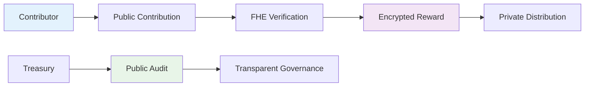

# 💰 Private Pay DAO
> **Revolutionary Decentralized Organization with Confidential Compensation**

[](https://private-pay-dao.vercel.app)
[](https://github.com/dylan96t/private-pay-dao)
[](LICENSE)
[](https://docs.zama.ai/fhevm)

---

## 🎯 Project Overview

**Private Pay DAO** represents the next evolution in decentralized organizations, where transparency meets privacy. By leveraging **Fully Homomorphic Encryption (FHE)**, we've created a platform that maintains complete transparency in operations while ensuring absolute confidentiality in compensation.

### 🔑 Key Differentiators

| Traditional DAOs | Private Pay DAO |
|------------------|-----------------|
| ❌ Public salary exposure | ✅ Encrypted compensation |
| ❌ Privacy concerns | ✅ Zero-knowledge privacy |
| ❌ Limited transparency | ✅ Full operational transparency |
| ❌ Centralized payroll | ✅ Decentralized FHE payroll |

---

## 🏛️ How It Works

### The Privacy-First Approach



### Core Components

1. **🔍 Public Contribution System**
   - All work is publicly verifiable
   - Transparent contribution tracking
   - Immutable audit trail

2. **🔐 FHE Encryption Engine**
   - Zama-powered privacy technology
   - Encrypted reward calculations
   - Zero-knowledge verification

3. **💰 Confidential Compensation**
   - Private salary management
   - Encrypted payment processing
   - Anonymous reward distribution

---

## 🚀 Getting Started

### Prerequisites

Before you begin, ensure you have:

- [ ] **Node.js** (v18 or higher)
- [ ] **npm** or **yarn** package manager
- [ ] **Git** version control
- [ ] **MetaMask** or compatible Web3 wallet
- [ ] **Sepolia ETH** for gas fees

### Quick Installation

```bash
# 1. Clone the repository
git clone https://github.com/dylan96t/private-pay-dao.git
cd private-pay-dao

# 2. Install dependencies
npm install

# 3. Environment configuration
cp env.example .env.local
# Edit .env.local with your settings

# 4. Start development server
npm run dev
```

### Environment Variables

Configure your `.env.local` file:

```env
# Network Configuration
VITE_CHAIN_ID=11155111
VITE_RPC_URL=https://sepolia.infura.io/v3/YOUR_INFURA_KEY

# Wallet Integration
VITE_WALLET_CONNECT_PROJECT_ID=YOUR_PROJECT_ID

# Smart Contract
VITE_CONTRACT_ADDRESS=YOUR_CONTRACT_ADDRESS
```

---

## 🛠️ Development Commands

### Frontend Development
```bash
npm run dev          # Start development server
npm run build        # Build for production
npm run preview      # Preview production build
npm run lint         # Run ESLint
npm run type-check   # TypeScript checking
```

### Smart Contract Operations
```bash
npm run compile      # Compile Solidity contracts
npm run deploy       # Deploy to Sepolia testnet
npm run deploy:local # Deploy to local network
npm run test         # Run contract tests
npm run verify       # Verify contract on Etherscan
```

---

## 🏗️ Project Architecture

```
private-pay-dao/
├── 📁 contracts/              # Smart contracts
│   ├── PrivatePayDAO.sol     # Main DAO contract
│   ├── FHEIntegration.sol    # FHE utilities
│   └── interfaces/           # Contract interfaces
├── 📁 src/                   # Frontend source
│   ├── components/           # React components
│   │   ├── dao/             # DAO-specific components
│   │   ├── wallet/          # Wallet integration
│   │   └── ui/              # Reusable UI components
│   ├── hooks/               # Custom React hooks
│   ├── lib/                 # Utilities and configurations
│   └── pages/               # Application pages
├── 📁 scripts/              # Deployment scripts
├── 📁 docs/                 # Documentation
└── 📁 tests/                # Test suites
```

---

## 🔒 Security & Privacy

### FHE Technology Implementation

Our platform uses **Zama's Fully Homomorphic Encryption** to ensure:

- **🔐 Encrypted Computations**: Process sensitive data without decryption
- **🛡️ Privacy-Preserving Analytics**: Generate insights without exposing individual data
- **🔒 Confidential Transactions**: Secure reward calculations and distributions
- **👤 Zero-Knowledge Proofs**: Verify contributions without revealing amounts

### Smart Contract Security

- **Access Controls**: Role-based permissions for sensitive operations
- **Multi-signature Requirements**: Treasury protection for large transactions
- **Audit Trail**: Immutable record of all operations
- **Verification System**: Multi-layer contribution validation

---

## 🌐 Deployment Guide

### Vercel Deployment (Frontend)

```bash
# Install Vercel CLI
npm i -g vercel

# Deploy to production
vercel --prod

# Configure environment variables in Vercel dashboard
```

### Smart Contract Deployment

```bash
# Compile contracts
npm run compile

# Deploy to Sepolia
npm run deploy

# Verify on Etherscan
npm run verify
```

### Manual Deployment

```bash
# Build the project
npm run build

# Deploy dist/ folder to your hosting provider
```

---

## 📊 Feature Matrix

### For Contributors
| Feature | Description | Status |
|---------|-------------|--------|
| **Wallet Connection** | Seamless Web3 wallet integration | ✅ Complete |
| **Contribution Tracking** | Real-time progress monitoring | ✅ Complete |
| **Reward Visibility** | Encrypted but verifiable compensation | ✅ Complete |
| **Reputation System** | Build credibility through contributions | 🚧 In Progress |

### For Organizations
| Feature | Description | Status |
|---------|-------------|--------|
| **Transparent Operations** | Public audit trail of activities | ✅ Complete |
| **Confidential Payroll** | Private compensation management | ✅ Complete |
| **Governance Tools** | Decentralized decision-making | 🚧 In Progress |
| **Analytics Dashboard** | Insights without privacy compromise | 📋 Planned |

### For Auditors
| Feature | Description | Status |
|---------|-------------|--------|
| **Public Verification** | Transparent treasury records | ✅ Complete |
| **Privacy Compliance** | FHE ensures individual privacy | ✅ Complete |
| **Real-time Monitoring** | Live organizational health tracking | 🚧 In Progress |
| **Historical Analysis** | Complete audit trail | 📋 Planned |

---

## 🛠️ Technology Stack

### Frontend Technologies
- **⚛️ React 18** - Modern UI framework with hooks
- **📘 TypeScript** - Type-safe development
- **⚡ Vite** - Lightning-fast build tool
- **🎨 Tailwind CSS** - Utility-first styling
- **🧩 shadcn/ui** - Accessible component library
- **🔗 RainbowKit** - Multi-wallet integration

### Blockchain & Privacy
- **⛓️ Ethereum Sepolia** - Testnet for development
- **🔐 Solidity 0.8.24** - Smart contract language
- **🛡️ Zama FHE** - Privacy-preserving computations
- **🔨 Hardhat** - Development and deployment framework

### Infrastructure
- **🚀 Vercel** - Frontend hosting platform
- **📦 IPFS** - Decentralized storage (planned)
- **📊 The Graph** - Blockchain indexing (planned)

---

## 🤝 Contributing

We welcome contributions from developers, designers, and community members!

### How to Contribute

1. **🍴 Fork** the repository
2. **🌿 Create** a feature branch (`git checkout -b feature/amazing-feature`)
3. **💻 Make** your changes
4. **✅ Test** thoroughly
5. **📝 Commit** with clear messages
6. **🚀 Push** to your branch
7. **🔄 Submit** a pull request

### Contribution Areas

- 🐛 **Bug Fixes**: Help us identify and resolve issues
- 💡 **Feature Development**: Implement new functionality
- 📝 **Documentation**: Improve guides and documentation
- 🧪 **Testing**: Ensure quality and reliability
- 🎨 **UI/UX**: Enhance user experience

---

## 📈 Development Roadmap

### ✅ Phase 1: Foundation (Completed)
- [x] Core DAO functionality implementation
- [x] FHE integration with Zama technology
- [x] Wallet connectivity and user authentication
- [x] Basic UI/UX design and implementation

### 🚧 Phase 2: Enhancement (In Progress)
- [ ] Advanced governance features
- [ ] Multi-chain support implementation
- [ ] Mobile application development
- [ ] Comprehensive API documentation

### 📋 Phase 3: Scale (Planned)
- [ ] Mainnet deployment preparation
- [ ] Enterprise-grade features
- [ ] Third-party integrations
- [ ] Advanced analytics and reporting

---

## 📄 License & Legal

This project is licensed under the **MIT License**. See the [LICENSE](LICENSE) file for complete details.

### Privacy & Compliance
- 🔐 All sensitive data encrypted using FHE technology
- 🛡️ Zero-knowledge proofs ensure privacy
- ⚖️ Compliant with privacy regulations
- 🔍 Transparent operations maintain accountability

---

## 🙏 Acknowledgments

Special thanks to:

- **Zama** for FHE technology and ongoing support
- **RainbowKit** for excellent wallet integration tools
- **Vercel** for seamless deployment platform
- **OpenZeppelin** for secure smart contract libraries
- **Community** for valuable feedback and contributions

---

## 📞 Support & Resources

| Resource | Link | Description |
|----------|------|-------------|
| 🌐 **Live Demo** | [private-pay-dao.vercel.app](https://private-pay-dao.vercel.app) | Try the platform |
| 📚 **Repository** | [github.com/dylan96t/private-pay-dao](https://github.com/dylan96t/private-pay-dao) | Source code |
| 🐛 **Bug Reports** | [Report Issues](https://github.com/dylan96t/private-pay-dao/issues) | Found a bug? |
| 💡 **Feature Requests** | [Request Features](https://github.com/dylan96t/private-pay-dao/issues/new) | Have an idea? |
| 📖 **Documentation** | [Full Docs](./DEPLOYMENT.md) | Detailed guides |
| 💬 **Discussions** | [Community](https://github.com/dylan96t/private-pay-dao/discussions) | Join the conversation |

---

<div align="center">

**🚀 Built with passion for the decentralized future**

*Empowering organizations with privacy-preserving transparency*

[⭐ Star this repo](https://github.com/dylan96t/private-pay-dao) • [🐛 Report Bug](https://github.com/dylan96t/private-pay-dao/issues) • [💡 Request Feature](https://github.com/dylan96t/private-pay-dao/issues)

</div>